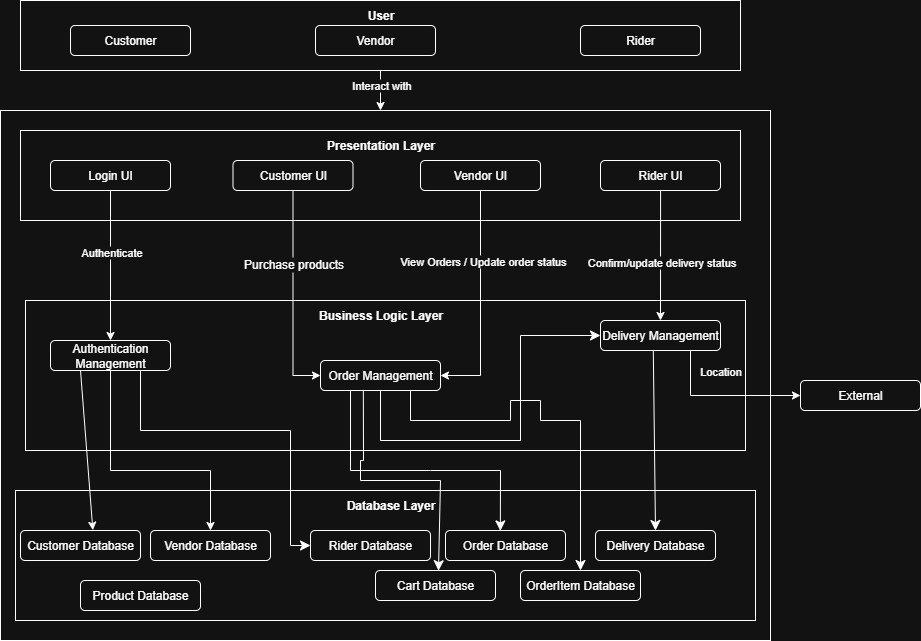
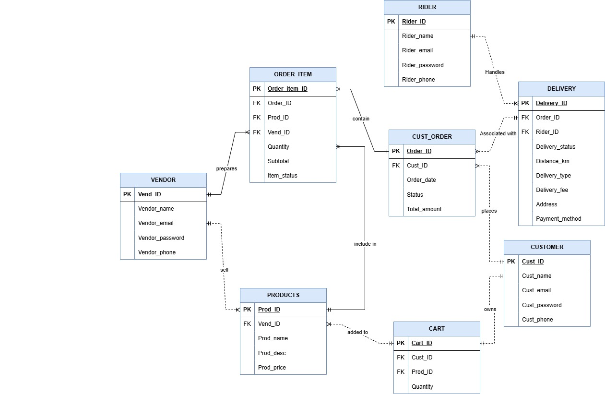
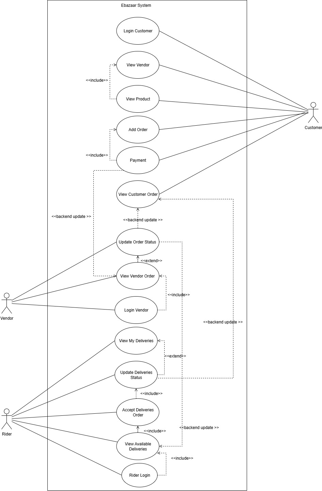

# eBaazar System
### Introduction
The eBazaar System is designed as a web-based online marketplace requiring backward integration of modernization and digitalization of the business of conventional community-based bazaars. It is being created manually with the focus on ease of use by customer in various user roles. The system allows integrating user registration and login, user interface displaying vendor management and vendor products, posting items to a cart, selecting delivery method and method of payment, order confirmation and review of an order history. Besides, the vendors will get their own interface in which they will be able to see the incoming orders by the customers as well as they will be able to update the status of each order as per the preparation steps. The system also allow the riders to see the list of available orders and change the status of the delivery including recording it as in transit, pending or delivered. The multi-role design makes the digital experience comprehensive and well arranged to all sides involved. Generally, eBazaar System facilitates flexibility, openness and accessibility, encouraging the digital interactions of customers, vendors and riders which will make the traditional bazaars enter a new era.

### Commercial Value/Third-Party Integration
In the eBazaar system, we integrated the OpenRouteService (ORS) API to enhance the real-world usability of the delivery module. This integration plays a crucial role in enabling dynamic delivery fee calculation based on a customer's actual location.

- Third-Party API Used: OpenRouteService (ORS)
ORS provides geocoding and routing capabilities, which are leveraged in our backend through a utility class ORSHelper.java. This external API offers free and reliable geographic services, making it suitable for startups and academic projects.

1. Geocoding Address to Coordinates:
When a user inputs a delivery address, the ORS Geocoding API translates it into geographic coordinates (latitude and longitude). This ensures accuracy in identifying delivery destinations, especially within Malaysia (boundary.country=MY).
2. Driving Distance Calculation:
The ORS Directions API is used to compute driving distance (in km) from a fixed pickup point (Mydin MITC Melaka) to the customer's address. This distance is essential for logistics cost estimation.
3. Dynamic Delivery Fee Calculation:
Based on the distance and selected delivery type (Standard or Express), the system calculates the delivery fee in real-time using configurable rates (e.g., RM0.35/km for Standard, RM0.45/km for Express). This fee is added to the order total before checkout.

Commercial Potential:
This integration adds real-world commercial value by simulating a location-aware delivery system, similar to those used in food or parcel delivery apps like Grab or Shopee. By automating delivery cost estimation:

- Vendors can avoid undercharging or overcharging.
- Customers get transparent pricing based on their location.
- Riders benefit from consistent, distance-based delivery planning.

Overall, the use of ORS elevates the eBazaar project from a basic online store to a more practical and scalable logistics-aware eCommerce system, making it a strong candidate for future commercial deployment.

# System Architecture
### High Level Diagram 


## Backend Application
# Technology Stack
- Language: Java
- Framework: Java Servlets (using MVC pattern)
- Database: MySQL (via JDBC + DAO pattern)
- IDE: Eclipse IDE for Enterprise Java
- Server: Apache Tomcat

# API Documentation
## API Endpoint
- API: /api/login
  - HTTP Method: GET

**Parameters:**
- `email`: ahmad.ismail@gmail.com 
- `password`: ahmad123

**Headers:**
```
Content-Type: application/json;charset=UTF-8
```

**Body Format:**
```json
{
  "email": "ahmad.ismail@gmail.com",
  "password": "ahmad123"
}
```
    
- API: /api/loginrider
  - HTTP Method: GET

**Parameters:**
- `email`: ali.rider@gmail.com  
- `password`: ali123

**Headers:**
```
Content-Type: application/json;charset=UTF-8
```

**Body Format:**
```json
{
  "email": "ali.rider@gmail.com",
  "password": "ali123"
}
```

- API: /api/loginvendor
  - HTTP Method: GET

**Parameters:**
- `email`: aromawangi.perfume@gmail.com  
- `password`: wangipassword123

**Headers:**
```
Content-Type: application/json;charset=UTF-8
```

**Body Format:**
```json
{
  "email": "aromawangi.perfume@gmail.com",
  "password": "wangipassword123"
}
```

- API: /acceptOrder
  - HTTP Method: POST

**Parameters:**
  - deliveryId: Integer (required)
  - riderId: Integer (optional – only for testing without session)

**Headers:**
```
Content-Type: application/x-www-form-urlencoded
```

**Body Format:**
```
deliveryId=1&riderId=2
```
    
- API: /api/cart
  - HTTP Method: POST

**Headers:**
```
Content-Type: application/json
```

**Body Format:**
```json
{
  "custId": 1,
  "productId": 101,
  "quantity": 2
}
```

  - HTTP Method:GET

**Parameters:**
```
custId=1
```

  - HTTP Method:PUT

**Headers:**
```
Content-Type: application/json
```

**Body Format:**
```json
{
  "custId": 1,
  "productId": 101,
  "quantity": 3
}
```
    
  - HTTP Method:DELETE

**Headers:**
```
Content-Type: application/json
```

**Body Format:**
```json
{
  "custId": 1,
  "productId": 101
}
```

    
- API: /api/delivery
  - HTTP Method: POST
- API: /api/customer/orders
  - HTTP Method: GET
- API: /api/order
  - HTTP Method: POST
- API: /api/products
  - HTTP Method: GET
- API: /updateDeliveryStatus
  - HTTP Method: POST
- API: /updateItemStatus
  - HTTP Method: POST
- API: /api/vendors
  - HTTP Method: GET
- API: /api/viewdelivery
  - HTTP Method: GET
- API: /vendor/viewOrderVendor
  - HTTP Method: GET

## Example Success and Error Responses

**Success Response:**  
**Status Code:** 200 OK  
**JSON Example:**
```json
{
  "success": true,
  "riderName": "Ali bin Abu",
  "riderId": 1
}
```

**Error Response:**  
**Status Code:** 200 OK  
**JSON Example:**
```json
{
  "success": false,
  "message": "Invalid credentials"
}
```

# Frontend Application
### 1) Customer Frontend
   The customer-facing frontend is a web application designed to provide a smooth shopping experience for customers who visit the eBazaar platform. Its main functions include allowing customers to register or log in, browse vendors and products, add items to their cart, confirm orders and review their order history. This application is intended for general users who wish to make purchases from local vendors through the eBazaar platform.

The frontend was developed using standard web technologies such as HTML, CSS and JavaScript. We used JSP (JavaServer Pages) for dynamic page rendering and relied on client-side scripting to manage UI behavior and make API calls. The application utilizes the Fetch API to interact with the backend server and uses localStorage to temporarily store customer information such as customer ID and name after login. This enables session-like persistence across multiple pages without requiring server-side sessions.

The frontend communicates with the backend by calling dedicated REST API endpoints. For example:

   - To authenticate the customer, it sends a POST request to /api/login.
   -  To fetch the list of vendors, it calls GET /api/vendors.
   -  To retrieve products of a selected vendor, it sends a GET request to /api/vendor/products?vendorId=....
   -  When confirming an order, it sends order details using POST /api/orders.
   -  For displaying the customer's past orders, it requests GET /api/customer/orders?custId=....

All these interactions are handled using JavaScript's fetch() function and the responses are processed dynamically to update the user interface.

### 2) Vendor Frontend
   The vendor‑owner frontend is a web application that empowers individual stall owners to manage every stage of their online bazaar presence. After authentication, a vendor lands on an intuitive dashboard that immediately greets them by name and lists all incoming pre‑orders filtered to their Vend_ID.

One of the core functions is the real-time preorder queue. Orders arrive with the status Pending and are displayed in a Bootstrap‑styled table. Vendors can update the status of each order using action buttons such as "Preparing", "Ready for Pickup", or "Rejected". These buttons trigger a fetch() POST request to /updateItemStatus, which ensures that riders and customers receive live updates on order progress.

The frontend communicates with the backend by calling dedicated REST API endpoints. For example:
   - To authenticate the vendor, it sends a POST request to /api/loginvendor with the vendor’s email and password. On success, it stores vendName and vendId in localStorage.
   - To fetch the list of preorders assigned to the logged-in vendor, it sends a GET request to /vendor/viewOrderVendor?vendId=.... The response contains a JSON object with an array of order items filtered by that vendor ID.
   - To update the status of a specific order item (e.g., "Preparing", "Ready for Pickup", or "Rejected"), the vendor UI sends a POST request to /updateItemStatus with the body parameters orderItemId and status.

All these interactions are handled using JavaScript’s fetch() function. The frontend processes the responses dynamically, refreshing the table and displaying alerts without reloading the page. Vendor login persistence is maintained using localStorage, and each operation is secured by backend session validation (vendId), ensuring that vendors can only manage their own orders.

### 3) Rider Frontend
The rider-facing frontend is a web application designed specifically for delivery personnel to efficiently manage and track their assigned deliveries. Upon successful login, riders are welcomed on a personalized dashboard that displays two primary sections:

  - New Orders to Accept (orders with status "Pending" and riderId = null)
  - My Deliveries (orders already assigned to the logged-in rider)

Each delivery entry is presented in a responsive Bootstrap-styled table, showing order details such as order ID, customer name, status, and delivery address. Riders can interact with action buttons like "Accept Order" and "Update Delivery Status" (e.g., to mark an order as  Transit, or Delivered). These buttons send asynchronous fetch() POST requests to the backend API.

The frontend communicates with the backend by calling dedicated REST API endpoints. For example:
   - Login: A POST request is sent to /api/loginrider with the rider’s email and password. On success, riderName and riderId are stored in sessionStorage, ensuring secure and personalized access to delivery data.
   - View Deliveries: A GET request is sent to /api/viewdelivery. The frontend filters the results using the riderId from sessionStorage to differentiate between unassigned and assigned orders.
   - Accept Order: When the rider clicks “Accept Order”, a POST request is sent to /acceptOrder with parameters deliveryId and riderId. The backend then assigns the rider to that delivery.
   - Update Delivery Status: To mark the delivery status (e.g., "Transit", "Delivered"), a POST request is sent to /updateDeliveryStatus with deliveryId and the new deliveryStatus.

These operations are handled using JavaScript’s fetch() function. The user interface updates dynamically without page reloads—ensuring a fast, responsive experience. Riders are only shown and allowed to interact with deliveries assigned to them, thanks to backend-side validation using the riderId. Persistent state is maintained via sessionStorage, and all sensitive actions are verified on the backend to prevent unauthorized delivery modifications.

# Database Design
## Entity-Relationship Diagram (ERD)


## Schema Justification
The system’s database is designed based on normalized relational principles to avoid data redundancy and ensure data consistency. The database consists of several main tables, including:

- Customer – stores customer details

- Vendor – stores vendor details

- Product – stores products offered by vendors

- Cart – temporary storage for products added to the cart

- Order – main record of an order placed by a customer

- OrderItem (bridge table) – details of individual items within an order

- Delivery – records delivery status for each order

Each table includes primary and foreign keys to establish one-to-many relationships, such as:
   - Each customer can places many orders, but each order can only be placed by one customer.
   - Customer can own one cart.
   - Each cart can add many products, but each product can be added to one cart,
   - Each vendor can prepares many orders from customers, and each orders can be prepared by many vendors.
   - Each vendor can sells many products, but each product can be sold by one vendor.
   - Each rider can handles many delivery, but each delivery can be handled by one rider.
   - Each delivery is associated with many orders, but each order is associate with one delivery.
   - Each product can be include in many orders, and each orders can include many products.

The OrderItem table acts as a bridge table between the Order and Product entities & Order and Vendor entities. This enables us to track multiple products within a single order and capture vendor information, quantities, and item statuses individually.

# Business Logic and Data Validation

## Use case


## Data Validation

### Frontend
In the eBazaar System, frontend validation is implemented using JavaScript to enhance user experience and prevent invalid data from reaching the backend. For example, on the customer, vendor and rider login page, the system ensures that both the email and password fields are filled before allowing submission and displays error messages if either field is empty. During checkout, users are required to provide a delivery address and select a payment method before confirming their order with alerts triggered if these inputs are missing. Additionally, the system checks localStorage to ensure that user session data such as custId and custName exist to  prevent unauthorized access to restricted pages like the cart or order history same goes to vendor that also use localstorage but rider use Url Query String. These client-side validations provide immediate feedback, reduce server load and help maintain data quality.

